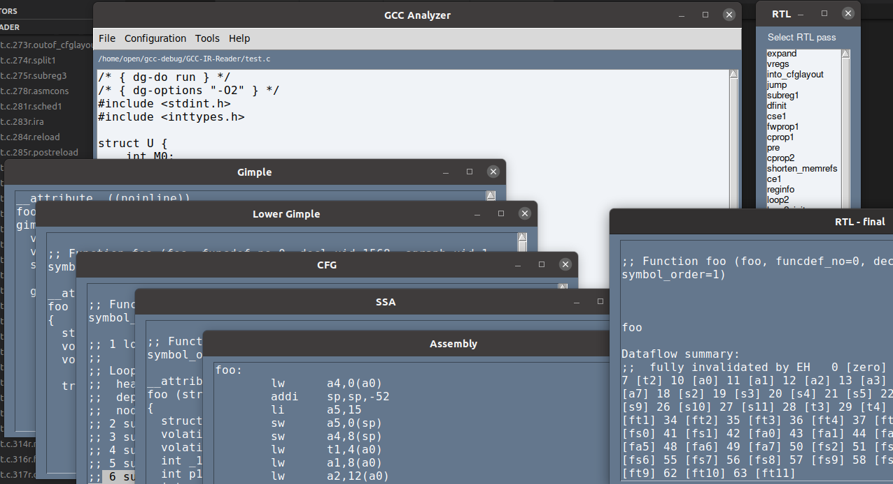

# GCC-IR-Reader

A simple to for generate and view the intermediate representation code in GCC.



## to do

-[x] rtl
-[] redesign : multithread & window control

## run

```
sudo apt-get install python3-tk 
pip3 install pysimplegui
```

```
python3 app.py
```
